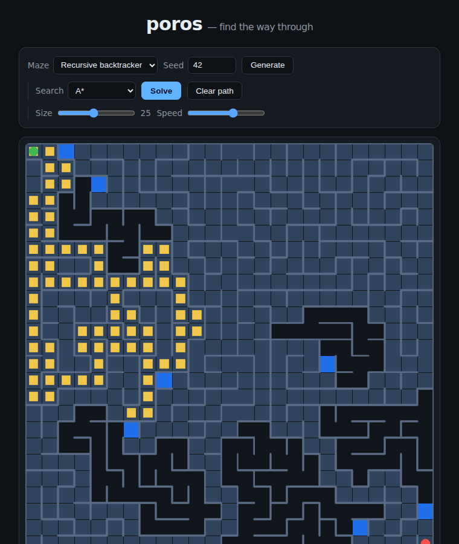

# poros

> *poros* (πόρος) — Greek for **passage, ford, a way through**.

An interactive **maze generation & pathfinding visualizer** that runs in the
browser with **zero dependencies** — no build step, no framework, no npm
install. The maze, the search, and the priority queue are all hand-rolled and
fully unit-tested.



## Run it

```bash
npm start          # serves at http://localhost:8080
# then open http://localhost:8080 in a browser
```

`npm start` launches a tiny static file server (`server.js`, also
dependency-free). You can equally open the project through any static server —
it's just `index.html` plus ES modules.

## Use it

- **Generate** a fresh maze with the *Recursive backtracker* (long winding
  corridors) or *Randomized Prim's* (bushier, more dead ends). The **seed**
  makes any maze reproducible.
- **Solve** it and watch the search explore in real time:
  - **A\*** — Manhattan heuristic, expands the fewest cells.
  - **Dijkstra** — uniform-cost, the unguided cousin of A\*.
  - **Breadth-first** — shortest path, explores in rings.
  - **Depth-first** — dives deep; finds *a* path, not the shortest.
- **Draw walls** by dragging on the grid — start near an edge to toggle it.
  The first drag direction locks add-vs-remove so a stroke is consistent.
- Tune **Size** and **Speed** live.

The stat line reports path length and **cells explored** — the honest measure
of how hard each algorithm worked. On the same maze you'll see A\* explore far
fewer cells than Dijkstra/BFS while all three agree on the shortest length.

## How it's built

The core is deliberately split from the UI so it can be tested under Node and
reused anywhere:

| File | Responsibility |
| --- | --- |
| `src/grid.js` | The grid model: cells, wall bits, carving, neighbours. No DOM. |
| `src/maze.js` | Generators (`recursiveBacktracker`, `randomizedPrim`) as step-yielding iterators, plus a seeded PRNG. |
| `src/pathfind.js` | `bfs`, `dfs`, `dijkstra`, `astar` as iterators yielding `visit`/`frontier`/`done` frames. |
| `src/heap.js` | A binary min-heap used as the priority queue for Dijkstra/A\*. |
| `src/app.js` | Browser-only: canvas rendering, animation, pointer-drawing, controls. |
| `server.js` | Minimal static file server with path-traversal protection. |

Both the maze generators and the pathfinders are **generator functions**: the
UI steps them frame-by-frame to animate, while tests just drain them to run to
completion. The same code path serves both.

## Test

```bash
npm test           # node --test, no dependencies
```

The suite (`test/`) covers the grid invariants, that every generator produces a
**perfect maze** (a spanning tree — fully connected, `cells − 1` edges), that
seeds are deterministic, that BFS/Dijkstra/A\* all agree on the shortest-path
length, that A\* never expands more cells than Dijkstra, that paths are
continuous legal moves, and the min-heap ordering.

## License

MIT
